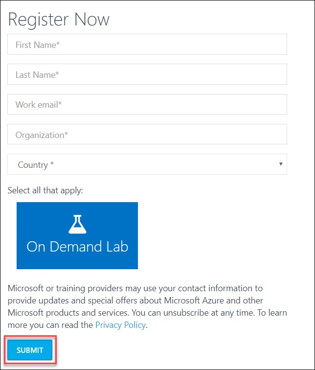
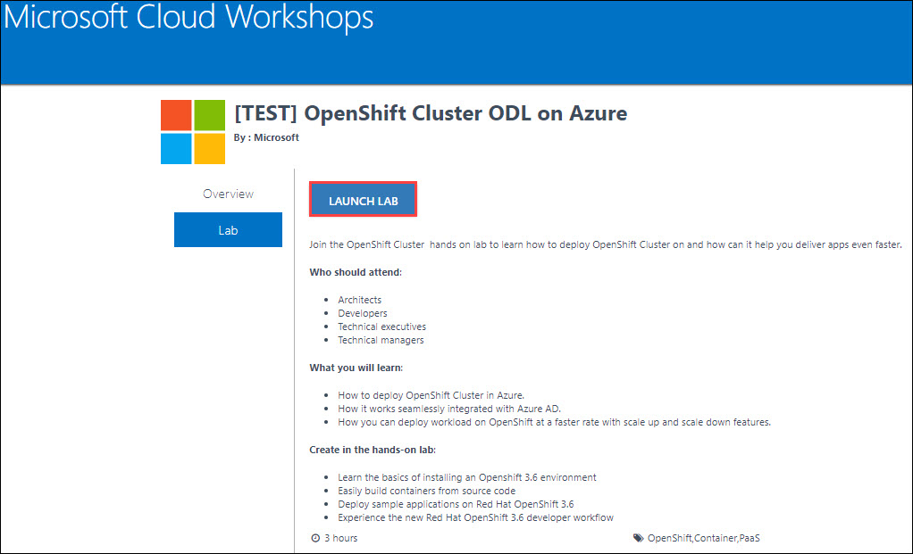
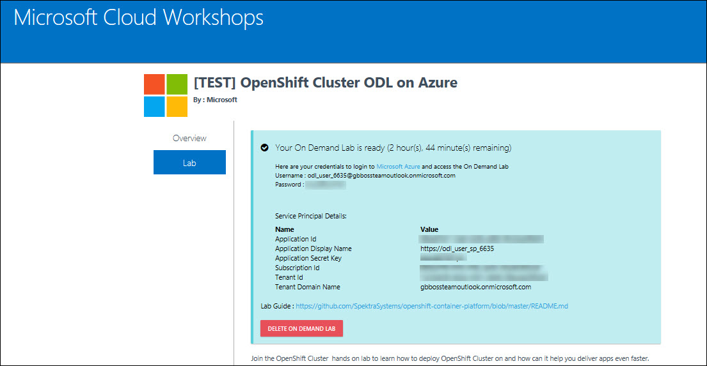
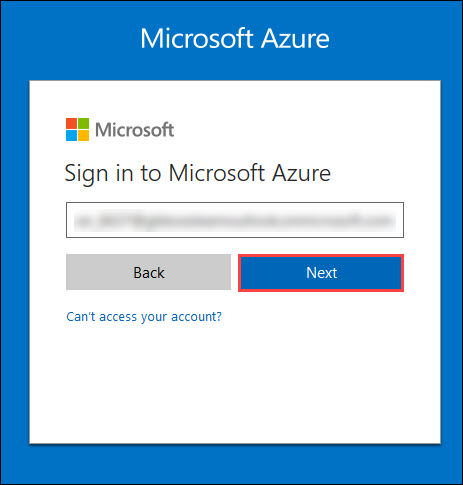
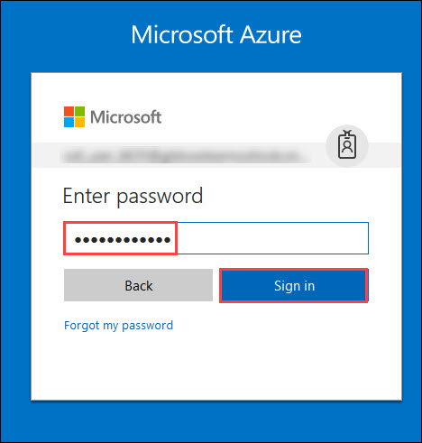
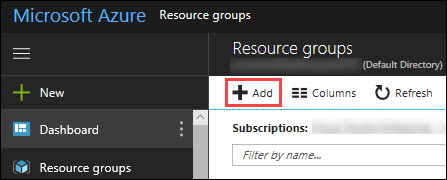
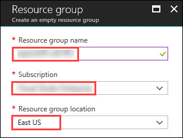
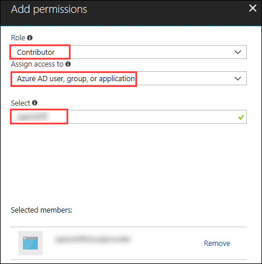

 ## Lab 01: Introduction to Azure Portal
 - [Option 1: Using Preconfigured Environment](#option-1-using-preconfigured-environment)
   * [Exercise 00: Log into your Azure Portal and Verify access to the Subscription](#exercise-00-sign-up-for-pre-configured-environment)
   * [Exercise 01: Log into your Azure Portal and Verify access to the Subscription](#exercise-01-log-into-your-azure-portal-and-verify-access-to-the-subscription)
 - [Option 2: Using own Subscription and configuring the Environment](#option-2-using-own-subscription-and-configuring-the-environment)
   * [Exercise 00: Log into your Azure Portal and deploy the pre-requisite environment](#exercise-00-log-into-your-azure-portal-and-deploy-the-pre-requisite-environment)   
### Lab Overview
This lab will take you through Azure login and portal experience and the pre-requisite environment.
If you do not have an Azure Subscription, or an environment where you can setup the pre-requisite for carrying out these labs, you should select [Option 1](#option-1-using-preconfigured-environment), else go to [Option 2](#option-2-using-own-subscription-and-configuring-the-environment)

### Prerequisites
-	Windows or a Mac machine with HTML5 supported browser such as Microsoft Edge, Internet Explorer, Chrome or Firefox
-	Red Hat Customer Portal login credentials so that the Azure instances can be registered with Red Hat Subscription Manager properly, and you must have enough OpenShift Container Platform entitlements to cover the chosen configuration.


### Option 1: Using Preconfigured Environment

### Time Estimate

10 minutes

### Exercise 00: Sign Up for pre configured environment

In this exercise, you will create a source environment.
1.	**Navigate** to training portal https://experience-azure.azurewebsites.net. 2.	Register by providing all required information and **clicking** on **SUBMIT button**.


2. Once registration is accepted, you will be automatically redirected to the lab activation page. Now, it is advised to save a copy of the URL on the browser, which has the activation id. **Click** on the **Launch Lab** button.


3. You will see the environment details soon below.

Please ensure to take the values assigned to your deployment.


### Exercise 01: Log into your Azure Portal and Verify access to the Subscription

In this exercise, you will log into the **Azure Portal** using your Azure credentials and you will verify the type of role you are assigned in this Subscription.
1.	**Launch** a browser in InPrivate/Incognito mode and **Navigate** to https://portal.azure.com. Provide the credentials that you received via email. Click on **Sign In**.


```
Note : At the first login, you may have to change the password, if asked for.
```

2.	**Enter** a new **password**. Then select **Update password and sign in**.


3.	Now, you will be directed to the **Azure Dashboard**


4.	**Launch** a browser and **Navigate** to https://portal.azure.com. **Login** with the Microsoft Azure credentials you received via email. 


5. **Click** on **Microsoft Azure** at the top left corner of the screen, to view the Dashboard.


6.	To toggle **show/hide** the Portal menu options with icon, **Click** on the **Show Menu** button. 


7.	**Click** on the **Resource groups** button in the **Menu navigation** bar to view the **Resource groups** blade.

"

8.	You will see a **Resource Group** which you have access to, **click** on it.


```
Note:
The Resource Group shown here is for demo purpose only. Actual name of the Resouce Group that you see may differ.
```

9.	From the **Resource Group** blade that come up, **Select** the Access Control ( IAM ) which is on the left side of the blade.


10.	In the new blade that come up, you can see the **role** that is assigned to you.


### Option 2: Using own Subscription and configuring the Environment

### Time Estimate

30 minutes

### Exercise 00: Log into your Azure Portal and deploy the pre-requisite environment

In this exercise, you will log into the **Azure Portal** using your Azure credentials and you will vdeploy the pre-requisite environment.
1.	**Launch** a browser and **Navigate** to https://portal.azure.com. Provide the credentials that you received via email. Click on **Sign In**.




2.	Now, you will be directed to the **Azure Dashboard**


3.	**Launch** a browser and **Navigate** to https://portal.azure.com. **Login** with the Microsoft Azure credentials you received via email. 


4. **Click** on **Microsoft Azure** at the top left corner of the screen, to view the Dashboard.


5.	To toggle **show/hide** the Portal menu options with icon, **Click** on the **Show Menu** button. 


6.	**Click** on the **Azure Active Directory** button in the **Menu navigation** bar to view the **Azure Active Directory** blade.


7.	You will be directed to the Azure Active Directory blade, **click** on **App registrations**.


8.	In the next blade, **click** on **New Application Registration** on top of the blade.


9.	In the **Create** blade, **configure** as follows:

-	Name: **(Provide a unique value)**
-	Application type: **Web app/API**
-	Sign-on URL: https://contoso.com

```
Note: We will change this value later during the lab.
```

And then **click** on **Create**.


10.	You will be redirected to the **App registrations** blade. You can check the app has been created by typing the App Name in the search field.


If the app has been created, you can see it in the results as shown above.

11.	Click on the **app** you **created** and you will be directed to the App blade.

12.	Copy the **Application Id** and **save** it in a notepad or any text editor for later use.


13.	Now, **Click** on **Keys** in the settings blade.


14.	In the **Keys** blade, **configure** as follows:

- Description: **key1**
- Expires: **Never expires**

And **Click** on **Save.**


15.	After you click on save, the **key value** will be displayed which is the Client Secret.
**Copy** the value into the text editor where you saved the value of **Application Id** for later use.


```
Note:
You will use the above app details for Azure Integration in Lab 02: Exercise 3
```

16.	**Click** on the **Resource groups** button in the **Menu navigation** bar to view the **Resource groups** blade.

"

17.	**Click** on the **Resource groups** button in the **Menu navigation** bar to view the **Resource groups** blade.

"

18.	You will be directed to the **Resource groups** blade, **click** on **+ Add**.

"

19. In the **Create** blade, **configure** as follows and then **click** on **Create**.

-	Resource Group Name: **(Provide a unique value)**
-	Subscription: **(Select your subscription)**
-	Resource Group Location: **(Select any Location)**

"

19.	Once the resource group is created, **Click** on the **Resource groups** button in the **Menu navigation** bar to view the **Resource groups** blade.

"

20.	You will see a **Resource Group** which you have created, **click** on it.

21.	From the **Resource Group** blade that come up, **Select** the Access Control ( IAM ) which is on the left side of the blade.


22.	In the new blade that come up, **click** on **+ Add**.


23. In the **Add Permissions** blade, **configure** as follows and then **click** on **Save**.

-	Role: **Contributor**
-	Subscription: **Azure AD user, group, or application**
-	Select: **(Type the name of the app you created before and Select that)**



[<Previous](https://github.com/SpektraSystems/openshift-container-platform/blob/master/README.md) /
[Next>](/docs/Lab%2002:%20Deploying-OpenShift-cluster-using-ARM-templates.md)
