## Lab 04: Integration of ACR with OpenShift

### Lab overview
In this lab, we will integrate ACR with OpenShift.

### Prerequisites
- Lab 03 must be completed

### Time Estimate
45 minutes

### Exercise 01: Integrate ACR with OpenShift 
In this exercise, you will deploy an Azure Container Registry and integrate it with OpenShift. 

1.	**Launch** a browser and **Navigate** to [Azure Portal](https://portal.azure.com). **Login** with the Microsoft Azure credentials you received via email. 
2.	Click on **+New** on the left side of the Dashboard.
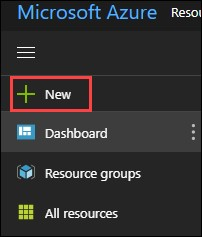 

3.	In the **New** blade that come up, Select **Containers**. 
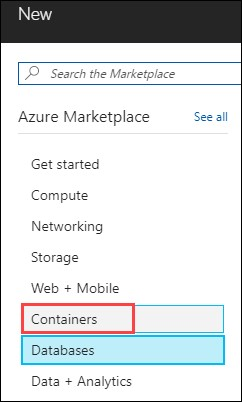 
 
4.	In the **Containers** blade appears. Select **Azure Container Registry**.
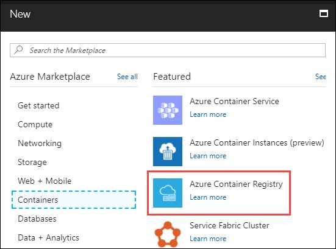 

5.	In the **create** blade that come up, **configure** the settings as follows:

-	Registry name  :  **uniquename** (This name should be unique across Azure.)
-	Subscription : Select the **existing** subscription
-	Resource Group : Choose Use existing and scroll down to see the Resource Group which is already there and select that)
-	Location: **South Central US**
-	Admin user: Select **Enable**
-	SKU: **Standard**

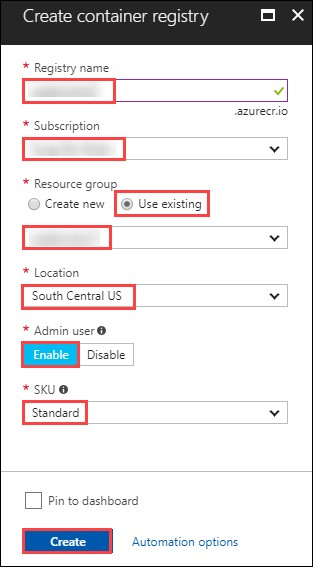  

And then **Click** on **Create**.

6.	You can see the status of the **deployment** from the **notifications** tab on top of the page.
 

7.	Once the deployment is **successful**, click on Go to resource from the notifications tab.
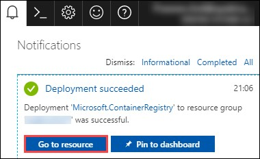 

8.	Now you will be directed to the deployed container registry. Click on the **Access keys** under Settings section which is on the left side of the blade.
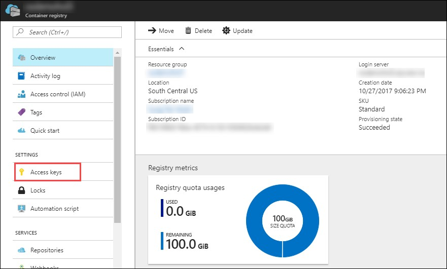 

9.	Now you will be directed to the **Access keys** blade.
Copy the **Registry name**, **Login server**, **Username** and **password** to a text editor for later use.
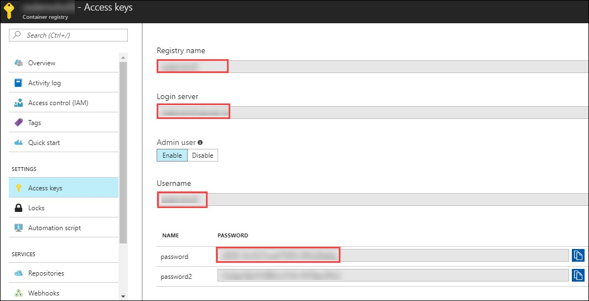 

10.	Now, open a new tab in a browser and navigate to the OpenShift console url. **Login** into the **OpenShift console** using the credentials you received via email by Selecting AzureAD as authentication type.
 

11.	Now you will be redirected to the **My Projects** page, where you will select the Project you created earlier.
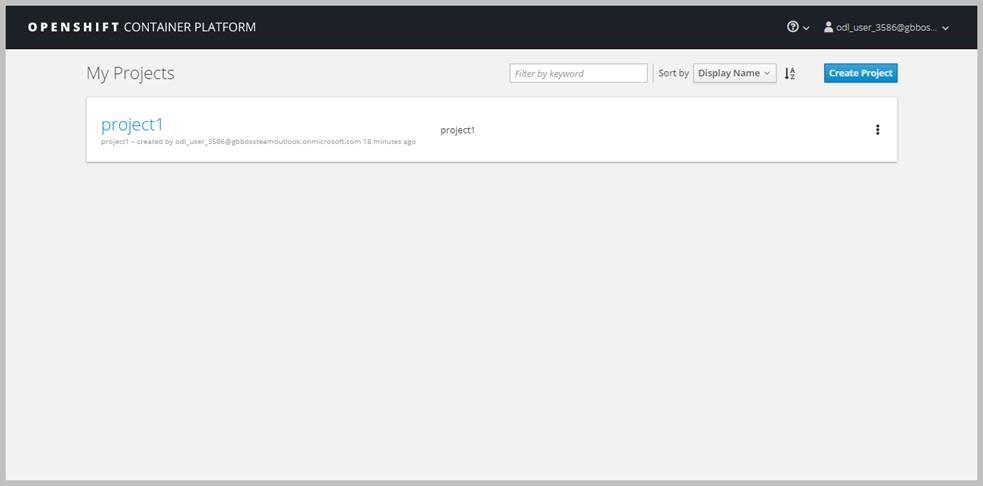 

12.	Once you are in the **project page**, click on **Applications** from the left side of the menu and in the new menu that comes up, click on **Pods**.
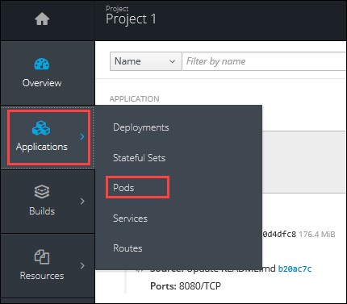 

13.	Now you will be redirected to the **Pods page**. Click on the pod with status as running.
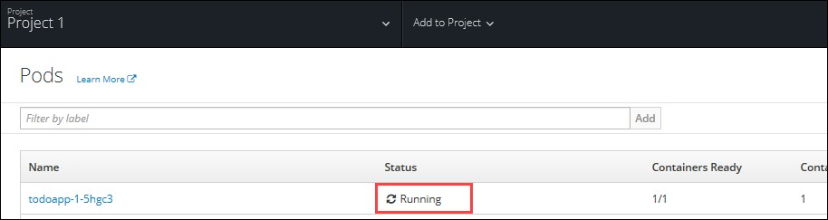 

14.	Now you will be directed to the **Details blade** of the selected Pod.
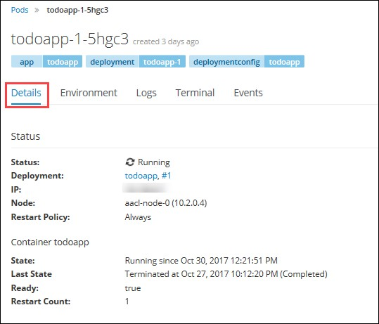 

15.	From the details blade, copy the **Private Ip** of the node in which the Pod is running.
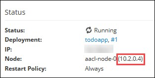 

16.	Now, **Open** a new tab in a browser and **Navigate** to https://portal.azure.com. **Login** with the Microsoft Azure credentials you received via email.
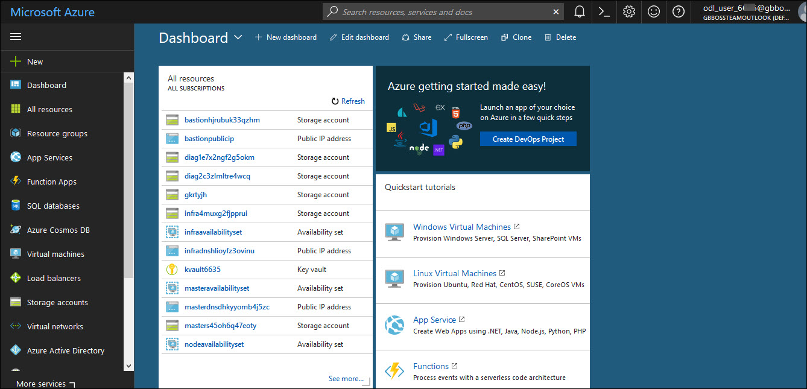 

17.	**Click** on **Cloud Shell**  at the top right corner of the screen, to open the cloud shell.
 

18.	Now the **bash shell** will open up.
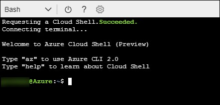 

19.	Now **execute** the following command. When promted, type **Yes** and you will be logged in to the OpenShift Master VM.
```
ssh ocpadmin@<copiedDNSNameofBastionVM>
```
```
Note: Substitute in the above command with the value of copied DNS Name of Bastion VM 
```
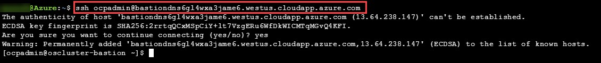 

20.	Now **execute** the following command in the cloud shell to pull a **docker image**. Copy the key into a text editor for later use.
```
ssh ocpadmin@<copiedPrivateIpOfNode>
```
```
Note: Substitute in the above command with the value of copied Private IP Address of Node in which pod is running.
``` 
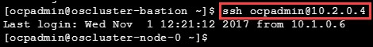 

21.	Now **execute** the following command in the cloud shell to **login** in to root account. 
```
sudo su -
```
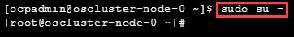 

22.	Now **execute** the following command in the cloud shell to check if the **docker** is **installed and running**. 
```
docker -v 
``` 
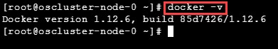 

23.	Now **execute** the following command in the cloud shell to **display** the list the **docker images** in the system. 
```
docker images
```
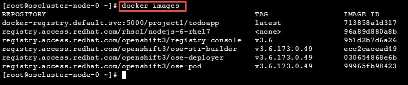 

24.	From the displayed results, **copy** the **Image name** with todoapp in the end.
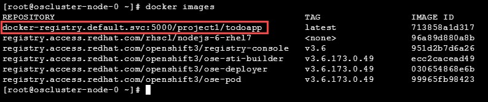 

25.	Now **execute** the following command in the cloud shell to **tag** the existing docker image.
```
docker tag <ImageName> <ACRLoginServerUri>/sample/todoapp
```
```
Note: 	Substitute for ImageName and ACR Login Server URI with the copied values in the above command
```
 

26.	Now **execute** the following command in the cloud shell to **login to docker registry**. When prompted, enter the **password** for ACR you copied earlier
```
docker login <acrServerLoginServerUri> -u <ACRUsername>
```
```
Note: Substitute for ACR Login Server URI and Username in the above command
```
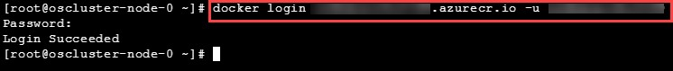 

27.	Now **execute** the following command in the cloud shell to **push** the tagged **image** to azure container Registry. Copy the key into a text editor for later use.
```
docker push <ACRLoginServerUri>/sample/todoapp
```
```
Note: Substitute for ACRLoginServerUri in the above command
``` 
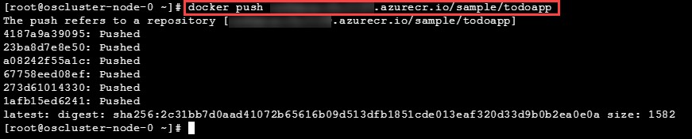 

28.	Once you have pushed the image to Azure Container Registry, click on **More services** on the left side of the menu on the dashboard.
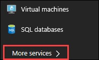 

29.	In the new blade that come up, search in the Filter box at the top “Container registries” and then Select **Container Registries** from the search result.
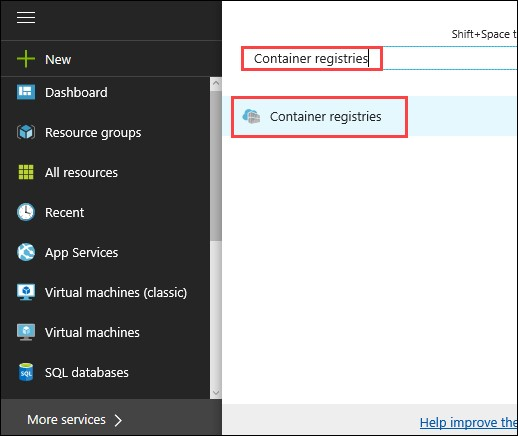 

30.	On the blade, select the **Container Registry** which you have created.
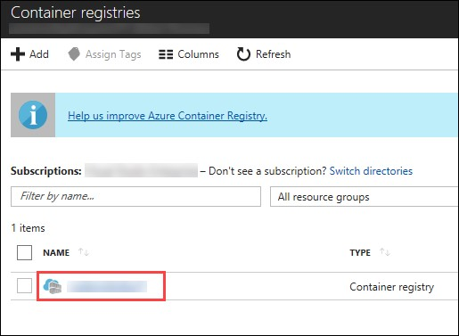 

31.	Now you will be directed to the **Overview page** of the container registry.
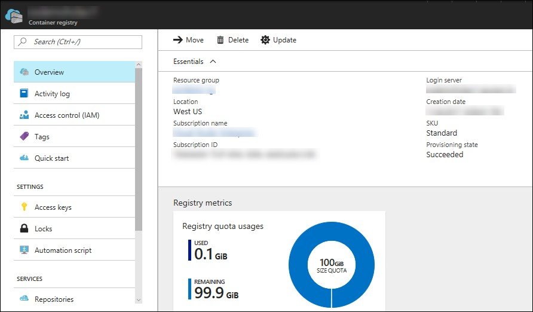 

32.	Now to check whether the image has been pushed to the repository, you can click on **Repositories** under Services on the menu on left side of the blade.
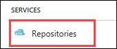 

33.	In the next blade that come up, if the push has been **successful**, you can see sample/todapp repository there. 
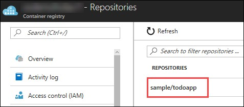 

[<Previous](/docs/Lab%2003:%20Deploying-workload-on-Openshift.md) /
[Next>](/docs/Lab%2005:%20Additional-Labs.md)
