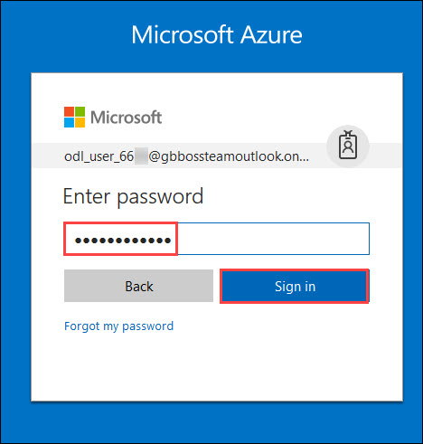

 ## Lab 1: Introduction to Azure Portal
 - [Option 1: Using Preconfigured Environment](#option-1-using-preconfigured-environment \)
   * [Exercise 1: Log into your Azure Portal](#exercise-1-log-into-your-azure-portal-and-verify-access-to-the-subscription)
   * [Exercise 2: Verify access to the Subscription](#exercise-2-verify-access-to-the-subscription)
 - Option 2: Using own Subscription and configuring the Environment
   
### Lab Overview
This lab will take you through Azure login and portal experience.

### Prerequisites
-	Windows or a Mac machine with HTML5 supported browser such as Microsoft Edge, Internet Explorer, Chrome or Firefox
-	You should have registered in the training portal https://experience-azure.azurewebsites.net and received the confirmation message with the credentials to login to the [Azure portal](http://portal.azure.com) or you should already have credentials to login into your own subscription.
-	Red Hat Customer Portal login credentials so that the Azure instances can be registered with Red Hat Subscription Manager properly, and you must have enough OpenShift Container Platform entitlements to cover the chosen configuration.


### Time Estimate

10 minutes

### Option 1: Using Preconfigured Environment

### Exercise 1: Log into your Azure Portal and Verify access to the Subscription

In this exercise, you will log into the **Azure Portal** using your Azure credentials and you will verify the type of role you are assigned in this Subscription.
1.	**Launch** a browser and **Navigate** to https://portal.azure.com. Provide the credentials that you received via email. Click on **Sign In**.




```
Note : At the first login, you may have to change the password, if asked for.
```

2.	**Enter** a new **password**. Then select **Update password and sign in**.


3.	Now, you will be directed to the **Azure Dashboard**


4.	**Launch** a browser and **Navigate** to https://portal.azure.com. **Login** with the Microsoft Azure credentials you received via email. 


5. **Click** on **Microsoft Azure** at the top left corner of the screen, to view the Dashboard.


6.	To toggle **show/hide** the Portal menu options with icon, **Click** on the **Show Menu** button. 


7.	**Click** on the **Resource groups** button in the **Menu navigation** bar to view the **Resource groups** blade.

"

8.	You will see a **Resource Group** which you have access to, **click** on it.


```
Note:
The Resource Group shown here is for demo purpose only. Actual name of the Resouce Group that you see may differ.
```

9.	From the **Resource Group** blade that come up, **Select** the Access Control ( IAM ) which is on the left side of the blade.


10.	In the new blade that come up, you can see the **role** that is assigned to you.


[<Previous](https://github.com/SpektraSystems/openshift-container-platform/blob/master/README.md) /
[Next>](/docs/Lab%202:%20Deploying-OpenShift-cluster-using-ARM-templates.md)
