## Lab 2: Deploying Open Shift cluster using ARM templates

* [Exercise 1: Create an Azure AD Application](#exercise-1-create-an-azure-ad-application)
* [Exercise 2: Create a Keyvault](#exercise-2-create-a-keyvault)
* [Exercise 3: Deploy Openshift Cluster using ARM Template](#exercise-3-deploy-openshift-cluster-using-arm-template)
* [Exercise 4: Configure Azure AD Authentication](#exercise-4-configure-azure-ad-authentication)
   
 
### Lab Overview
In this lab, you will learn how to deploy the Open Shift Cluster on Azure using ARM templates.
### Prerequisites
*	Lab 1 must be completed

### Time Estimate
120 minutes

### Exercise 1: Create an Azure AD Application
In this exercise, you will create an Azure AD App and retrieve the Client ID and Client secret values.
1.	**Launch** a browser and **Navigate** to https://portal.azure.com. **Login** with the Microsoft Azure credentials you received via email.


2.	**Click** on the **Azure Active Directory** button in the **Menu navigation** bar to view the **Azure Active Directory** blade.


3.	You will be directed to the Azure Active Directory blade, **click** on **App registrations**.
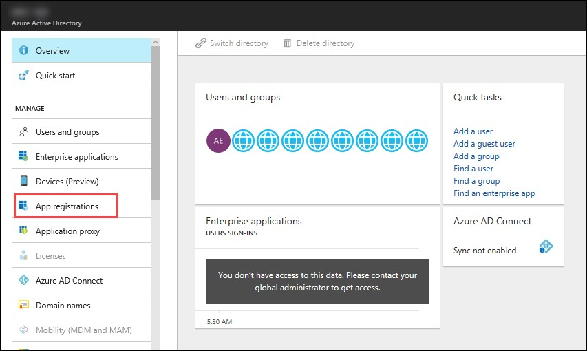

4.	In the next blade, **click** on **New Application Registration** on top of the blade.
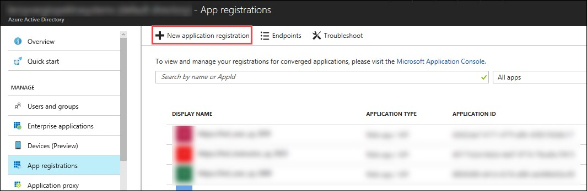

5.	In the **Create** blade, **configure** as follows:

-	Name: **(Provide a unique value)**
-	Application type: **Web app/API**
-	Sign-on URL: https://contoso.com

```
Note: We will change this value later during the lab.
```

And then **click** on **Create**.

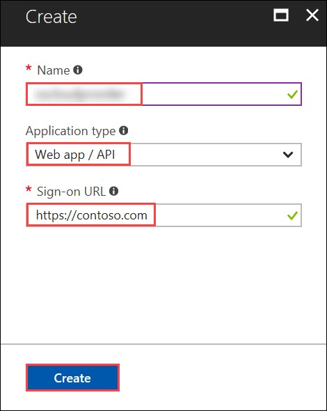

6.	You will be redirected to the **App registrations** blade. You can check the app has been created by typing the App Name in the search field.
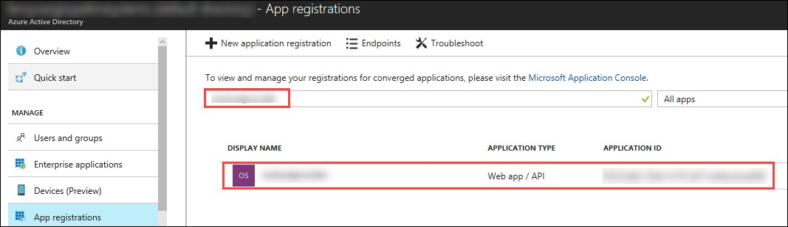

If the app has been created, you can see it in the results as shown above.

7.	Click on the app you created and you will be directed to the App blade.

8.	Copy the Application Id and save it in a notepad or any text editor for later use.
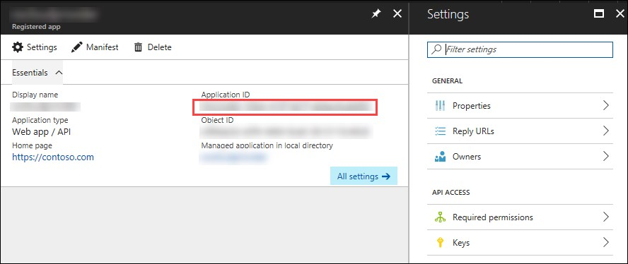

9.	Now, **Click** on **Keys** in the settings blade.
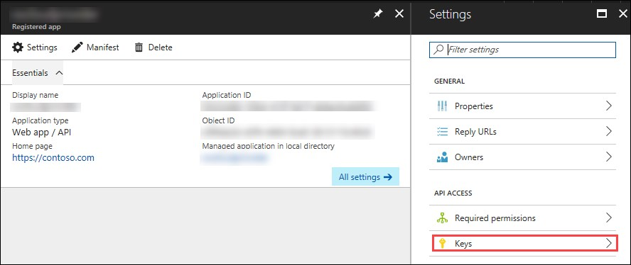

10.	In the **Keys** blade, **configure** as follows:

- Description: **key1**
- Expires: **Never expires**

And **Click** on **Save.**

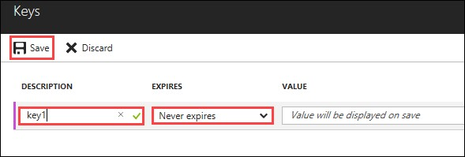

11.	After you click on save, the key value will be displayed which is the Client Secret.
Copy the value into the text editor where you saved the value of Application Id for later use.
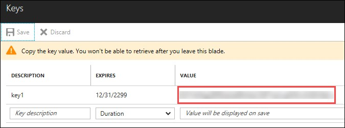

12.   Now go back to the setting blade of the App and Click on Required permissions.
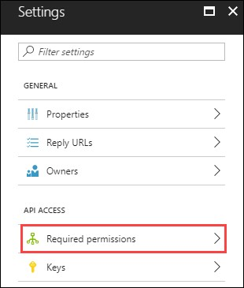

13.   Click on Grant Permissions in the blade that come up and then **Click** on **Yes**
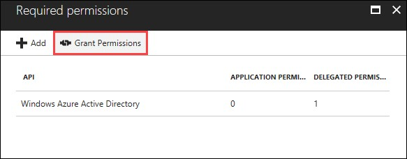
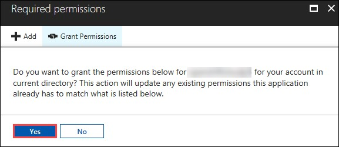

### Exercise 2: Create a Keyvault 
In this exercise, you will configure Azure Bash Cloud Shell and create a Key vault in the existing resource group and store the SSH key inside the vault. 
1.	**Launch** a browser and **Navigate** to https://portal.azure.com. **Login** with the Microsoft Azure credentials you received via email.
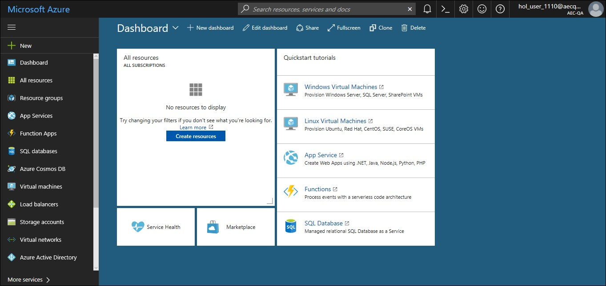

2.	**Click** on **Cloud Shell**  at the top right corner of the screen, to open the cloud shell.


3.	Then **Click** on **Bash ( Linux )**, and in the next page, **click** on **Show advanced settings**
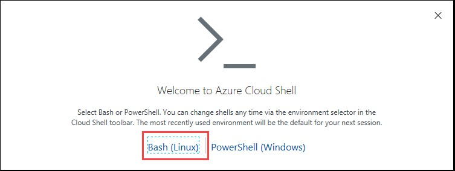
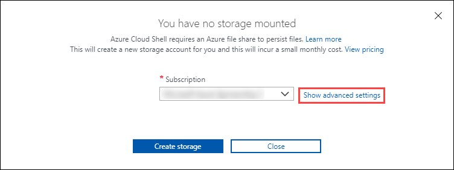

4.	In the new blade, select the existing resource group, provide unique names under Create new(Storage account and File share) and **click** on **Create Storage**.
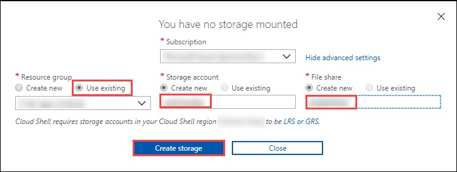

5.	In a few minutes, the bash shell will come up.
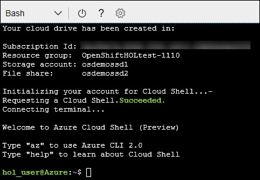

6.	Now execute the following command in the cloud shell to create a key vault in the existing resource group.
```
az keyvault create -n <uniquename> -g <ResourceGroup> -l <LocationOfResourceGroup> 
--enabled-for-template-deployment true
```
```
Note:
Provide the existing Resource Group name, it’s location and a unique name for key vault in the above command when executing
```
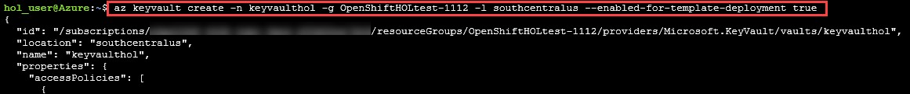

7.	Now execute the following command in the cloud shell to generate ssh key.
```
ssh-keygen
```
```
Note: Keep on clicking enter button until the key has been created.
```


8.	Now execute the following command in the cloud shell to display the public ssh key. Copy the key into a text editor for later use.
```
cat .ssh/id_rsa.pub
```
```
Note: 
The copied SSH Key should be made into a single line. You will need this key for later use.
```
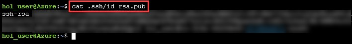

9.	Now execute the following command to store the generated key in the key vault.
```
az keyvault secret set --vault-name <keyvaultname> -n osdemovaultsecret --file ~/.ssh/id_rsa
```
```
Note:
Substitute for key vault name in the above command with the name of the keyvault created earlier when executing.
```
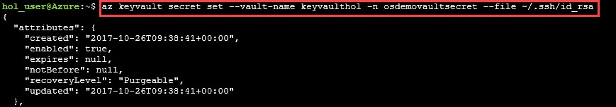

## Exercise 3: Deploy Openshift Cluster using ARM Template  
In this exercise, you will deploy the Openshift cluster on Azure using ARM Template . 
1.	**Launch** a browser and **Navigate** to `https://github.com/SpektraSystems/openshift-container-platform`

2.	Now **click** on **Deploy to Azure** button and you will be redirected to the azure portal. If prompted **login** with the Microsoft Azure credentials you received via email.

[](https://portal.azure.com/#create/Microsoft.Template/uri/https%3A%2F%2Fraw.githubusercontent.com%2FSpektraSystems%2Fopenshift-container-platform%2Fmaster%2Fazuredeploy.json)

3.	Now you will be directed to the Custom Deployment blade.
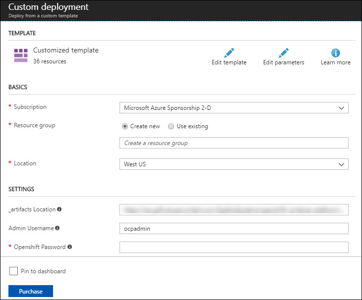

4.	In the **Custom Deployment** blade, **configure** the settings as follows:
-	Resource Group : Choose Use **existing** and scroll down to see the Resource Group which is already there)
-	Openshift Password  :  **Provide a unique password**
-	Ssh Public Key :  **Provide the copied SSH key**
-	Rhsm Username or Org Id: **Provide the username of Redhat credentials**
-	Rhsm Password or Org Id: **Provide the password of Redhat credentials**
-	Rhsm Pool Id: **Provide the pool Id of Redhat OpenShift Subscription**
-	Key Vault Name : **Provide the Key Vault name you provided**
-	Key Vault Secret : **osdemovaultsecret**
-  Azure Integration Cient Id : **Provide the Application ID which is received via email**
-  Azure Integration Client Secret : **Provide the Application Secret Key which is received via email**
-	Aad Auth App Name : **Provide the name of the AD App you created** 
-	Aad Auth App Id : **Provide the Client ID of the AD App you created** 
-	Aad Auth Client Secret : **Provide the secret key of the AD App**
**And** accept the terms of conditions.
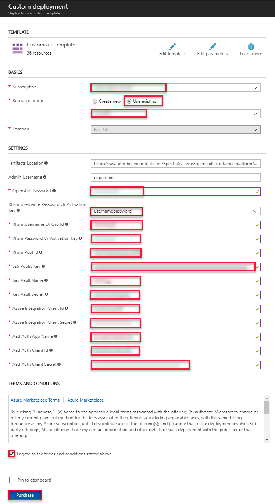

5.	And then **click** on **Purchase**.

6.	Once the deployment starts, you can see the progress in the notification bar at the top of the Azure portal.
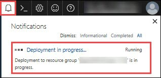

7.	Once the deployment is complete, you can see it in the notifications tab as Deployment succeeded. Now, **click** on **Go to resource group** from the notifications tab.
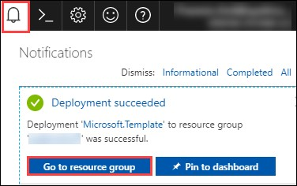

8.	In the resource group blade that come up, you can see the deployments as Succeeded, click on that.
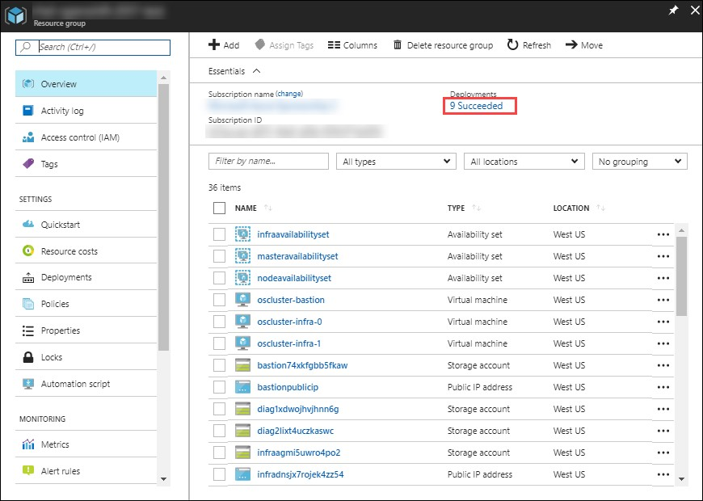

9.	Select **Microsoft Template** from the new blade that come up.
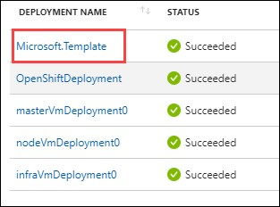

10.	From the new blade that come up, you can see the outputs of the deployment.
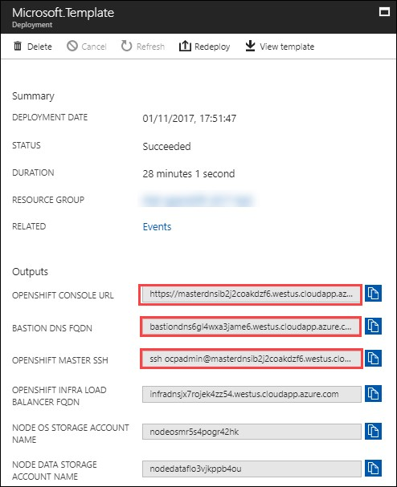

11.	Copy the Openshift Console URL, Bastion DNS FQDN and OpenShift Master SSH by clicking on Copy to a text editor

12.	To verify that the deployment is working, **Open** a new tab in the browser and paste the copied URL.
```
Note: Skip the certificate warning
```

13.	Now you will be directed to the Openshift Console Login page.


```
Note: If the above page comes up, then the deployment is working.
```

## Exercise 4: Configure Azure AD Authentication
In this exercise, you will configure the AD App you created for Authentication into the Open Shift console.
1.	**Launch** a browser and **Navigate** to https://portal.azure.com. **Login** with the Microsoft Azure credentials you received via email.


2.	**Click** on the **Azure Active Directory** button in the **Menu navigation** bar to view the **Azure Active Directory** blade.


3.	You will be directed to the Azure Active Directory blade, **click** on **App registrations**.


4.	You will be redirected to the **App registrations** blade. You can search the App by typing the name of the App you created earlier, in the search field.


5.	Click on the app you created and you will be directed to the App blade.
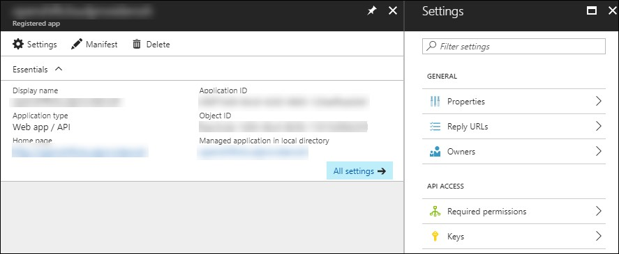

6.	Now Click on Properties under Settings blade.
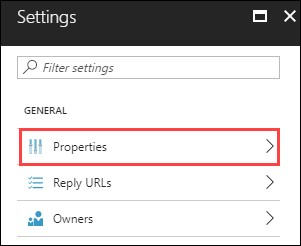

7.	In the **Properties** blade, **edit** as follows:
-	App ID URI: (Provide the Open Shift Console URI)
-	Home Page URL type: (Provide the Open Shift Console URI)
And then **click** on **Save**.
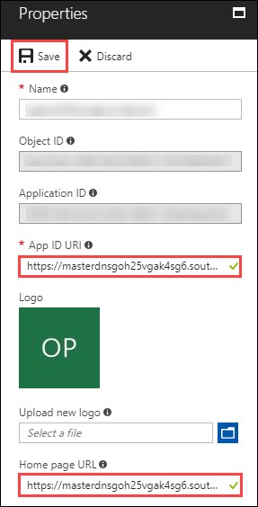

8.	Once you save the properties, close the properties blade.
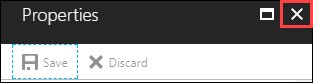

9.	Then you will be redirected to the Settings Blade of AD App. Click on the Reply URLs
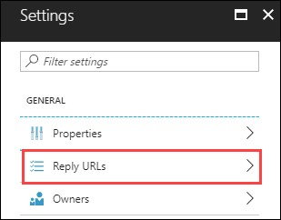

10.	Now modify the openshift console url by removing the ‘console’ from the end and appending ‘oauth2callback/AzureAD’ to the url and provide it in the Reply URL blade that come up and then Click on Save. 
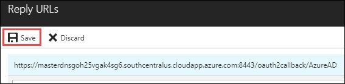

11.	Now to verify that the user is able to authenticate to Openshift console via Azure AD, **Open** a new tab in the browser and paste the Openshift Console URL which you copied earlier.
```
Note: Skip the certificate warning
```


12.	Now click on AzureAD, you will be redirected to the Login Page. Provide the Azure credentials you received via email over there and click on Sign in.
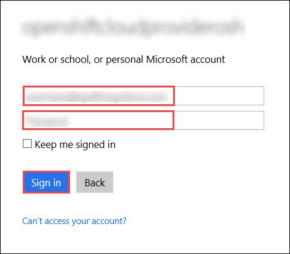

13.	Once the login is successful, you will be redirected to the Openshift console.
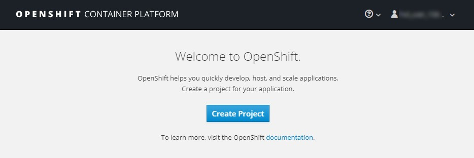  

[<Previous](/docs/Lab%201:%20Introduction-to-Azure-Portal.md) /
[Next>](/docs/Lab%203:%20Deploying-workload-on-Openshift.md)
